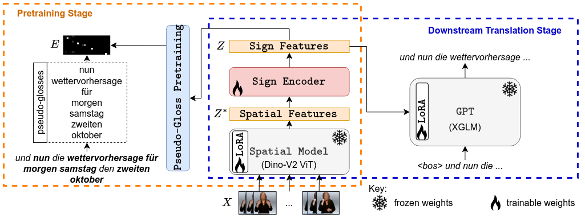

# Sign2GPT: Leveraging Large Language Models for Gloss-Free Sign Language Translation

This repo is the official implementation of "Sign2GPT: Leveraging Large Language Models for Gloss-Free Sign Language Translation".




## Environment Setup

Build the Docker image using the `Dockerfile` and `environment.yml` files provided.

## Dataset Preparation

Request access for CSL-Daily from the authors of "Improving Sign Language Translation with Monolingual Data by Sign Back-Translation" (Zhou et al.) and add it to folder named `csldaily`.

1. Create the tsv file for easier reading of the dataset using `scripts/csldaily/tsv_processing.py`

2. Since the dataset is divided into frames, using the script `scripts/csldaily/video_creator.py` to convert the individual frames to videos which are saved in `dataset_creation/csl-daily` folder. You will need to do this for every sequence in the dataset.

3. Convert the videos into lmdbs using `scripts/csldaily/image_lmdb_creator.py`. You will need to do this for every video in the dataset.

4. Create the pseudo-gloss dictionary pickle file with `scripts/csldaily/pseudo_gloss_zn.py`

5. Update the paths in `configs/base/base_utils.py` for `ckpt_path` and `lmdb_path` to your desired checkpoint save location and base path for the lmdb directory.

6. If you plan on using Weights and Biases add the api key to `environment_variables.py` and in the config files set:
```
cfg.logger_name = ['wandb']
```

## Pretraining Stage

Run the pretraining stage:
```bash
python main.py --config=configs/csldaily/csldaily_stage1_configs/CSL_example_s1_config.py
```

## Downstream Training Stage

Run the downstream training stage:
```bash
python main.py --config=configs/csldaily/csldaily_stage2_configs/CSL_example_s2_config.py
```

**NOTE:** By default during training BLEU scores are the teacher forcing scores (`obleu`) every epoch. If you want to get the true BLEU scores (which takes longer) you need to get `ableu` scores which are run every 10 epochs on the validation set.

# Citation
```
@inproceedings{
  wong2024signgpt,
  title={Sign2{GPT}: Leveraging Large Language Models for Gloss-Free Sign Language Translation},
  author={Ryan Wong and Necati Cihan Camgoz and Richard Bowden},
  booktitle={The Twelfth International Conference on Learning Representations},
  year={2024},
  url={https://openreview.net/forum?id=LqaEEs3UxU}
}
```
